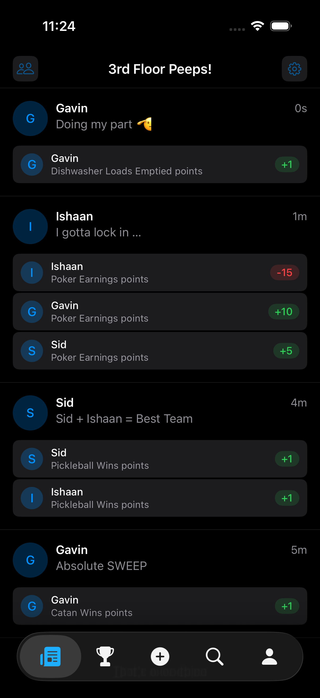
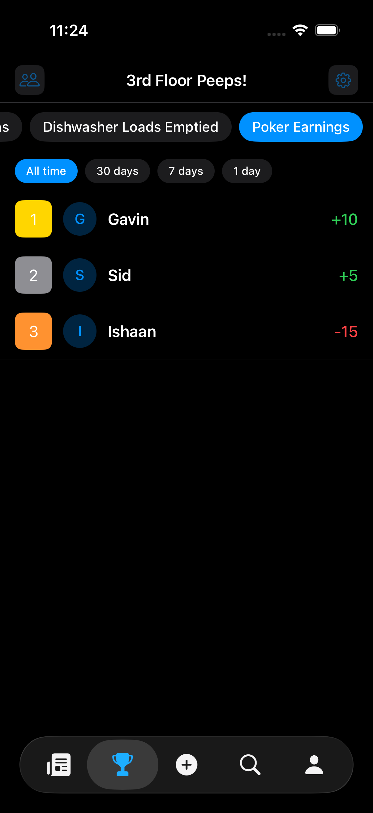
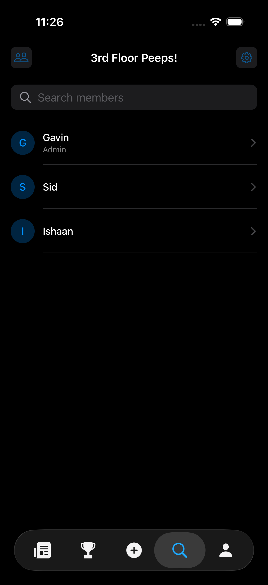
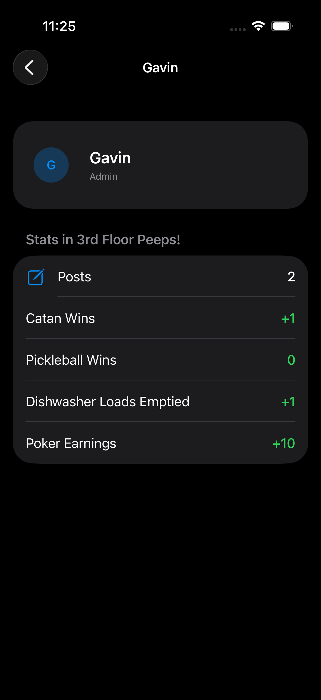
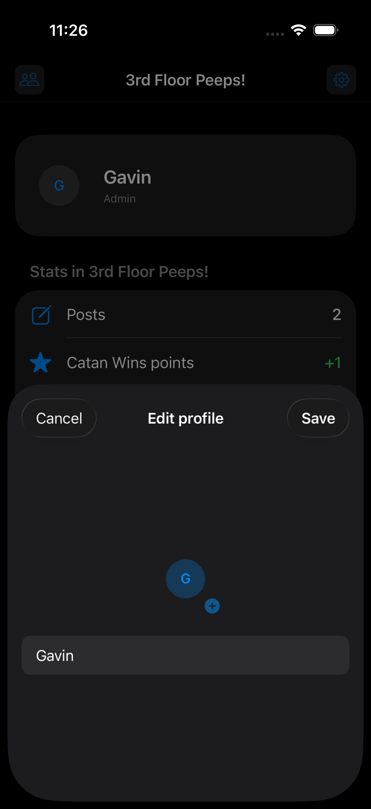
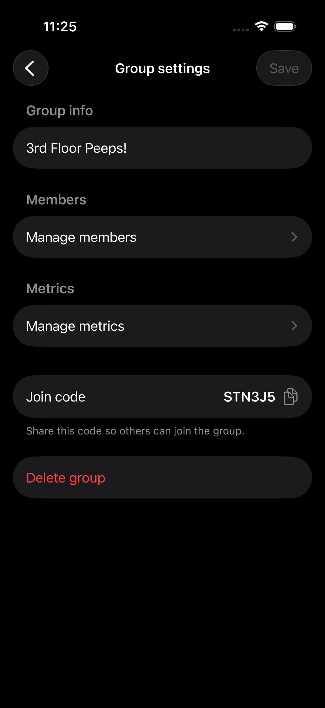
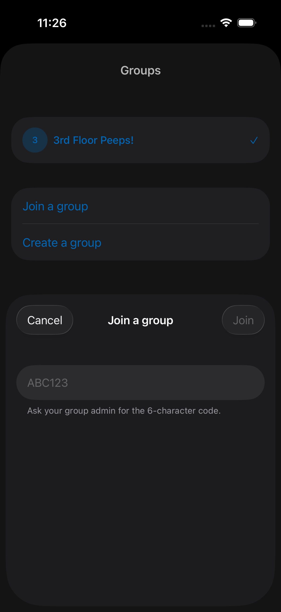

# Group Leader

An iOS app for keeping score in a group. You create a group, invite people with a join code, define the things you want to track ("metrics"), and then award each other points by posting about it. Every metric gets its own leaderboard.

Built as a project to learn Swift and SwiftUI. It's feature-complete for what it set out to do and is no longer under active development, see [Status](#status).

## Demo

Check out [this](https://appetize.io/app/b_myrsckuh63623eir6ddv5g6qda?device=iphone17pro&osVersion=26.0&appearance=dark&autoplay=true&toolbar=false) link to interact with the live demo of Group Leader!

## Screenshots

<table>
  <tr>
    <td align="center" width="25%">
      <br />
      <sub><b>Feed</b><br />Every post in the group, with who got points for what</sub>
    </td>
    <td align="center" width="25%">
      <br />
      <sub><b>Leaderboard</b><br />Per-metric rankings, filterable by time window</sub>
    </td>
    <td align="center" width="25%">
      <br />
      <sub><b>New post</b><br />A caption plus any number of point assignments</sub>
    </td>
    <td align="center" width="25%">
      <br />
      <sub><b>Search</b><br />Find members within the group, admins badged</sub>
    </td>
  </tr>
  <tr>
    <td align="center" width="25%">
      <br />
      <sub><b>Profile</b><br />Avatar, username, post count, point totals</sub>
    </td>
    <td align="center" width="25%">
      <br />
      <sub><b>Edit profile</b><br />Swap your avatar from the photo library, change your username</sub>
    </td>
    <td align="center" width="25%">
      <br />
      <sub><b>Group settings</b><br />Admin-only: members, metrics, join code</sub>
    </td>
    <td align="center" width="25%">
      <br />
      <sub><b>Joining</b><br />Six-character codes to get people in</sub>
    </td>
  </tr>
</table>

## What it does

**Groups**
- Create a group, or join one with a 6-character code
- Belong to multiple groups and switch between them
- Leave a group (membership is soft-deleted, so your point history stays intact for everyone else)
- The group's creator is its admin

**Metrics**
- Admins define per-group metrics — whatever the group wants to track
- Each metric is scored independently

**Posts and points**
- A post has an optional caption and one or more point assignments
- Each assignment is a recipient, a metric, and a value
- The feed shows every post in the group with its assignments

**Leaderboards**
- One leaderboard per metric, selectable from a picker
- Time filters: all time, 30 days, 7 days, 1 day
- Gold / silver / bronze styling for the top three

**People**
- Search members within a group
- Profiles with avatar, username, and post count
- Upload an avatar from your photo library
- Admins can remove members

## How it works

**Stack:** SwiftUI + [supabase-swift](https://github.com/supabase/supabase-swift) (2.5.1+, via SPM). Postgres, auth, and file storage all come from Supabase; there's no backend of my own.

**Navigation** is driven by a state machine in `RootView`, which subscribes to `supabase.auth.authStateChanges` and resolves to one of four states:

```
unauthenticated → needsUsername → needsGroup → authenticated
```

Each transition is a real check against the database — is there a session, does a `users` row exist for it, is there an active group membership — rather than a flag stored on the client. `ContentView` takes over once you're in a group and hosts the five tabs.

**Auth** is email + password with 6-digit OTP email verification. A pending verification email is persisted to `UserDefaults`, so killing the app mid-signup drops you back on the verify screen instead of losing the flow.

**Security** is entirely row-level. The app ships a publishable key, which is public by design — it's in `SupabaseClient.swift` on purpose. The actual boundary is the RLS policies in `supabase/rls_policies.sql`: every policy targets `authenticated` only, so a signed-out client (`anon`) can read nothing at all. Cross-table checks like "is this user an active member of this group" go through `SECURITY DEFINER` helper functions, which is what keeps a policy on `group_members` from recursing into itself.

## Project structure

```
GroupLeader/
├── GroupLeaderApp.swift      @main entry point
├── RootView.swift            auth/onboarding state machine
├── ContentView.swift         tab shell for a selected group
├── SupabaseClient.swift      shared client, snake_case ↔ camelCase coding
├── CustomColors.swift        podium colors
├── Models/                   Codable row types + view-facing detail models
├── Styles/
└── Views/
    ├── Auth/                 sign in, sign up, OTP, username creation
    ├── Groups/               list, create, join, leave, switch
    ├── GroupSettings/        rename, members, metrics, join code, delete
    ├── Feed/                 post list, post detail, assignments
    ├── NewPost/              caption + assignment composer
    ├── Leaderboard/          metric picker, time filters, rankings
    ├── Search/               member search, other users' profiles
    ├── Profile/              own profile, edit, sign out
    └── ProfilePicture/       avatar rendering with initials fallback
```

## Data model

| Table | Notes |
|---|---|
| `users` | Profile row keyed to the auth user; username and `avatar_url` |
| `groups` | `created_by` doubles as the admin, `join_code` for invites |
| `group_members` | `is_active` + `left_at` — leaving is a soft delete |
| `metrics` | Scoped to a group |
| `posts` | Author, group, optional caption |
| `point_assignments` | Belongs to a post; recipient, metric, value |

Avatars live in a public `avatars` storage bucket at `<user_id>/avatar.jpg`, uploaded with upsert so re-uploading replaces cleanly.

The two things worth knowing if you read the schema: `group_members.is_active` means point history survives someone leaving, and admin is derived from `groups.created_by` rather than stored as a role.

## Status

Shelved. It works end to end, but it isn't published anywhere, and getting it onto the App Store would mean a lot of compliance work that didn't make sense for a project this size. I did learn a lot from this project, especially on the Swift side of things, but for now it is best to just move on.
